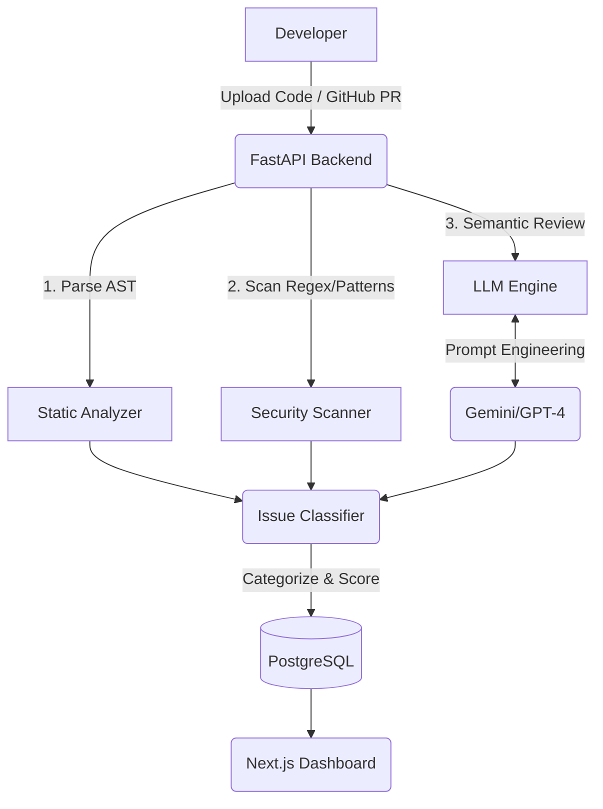

<div align="center">
  

  # 🛡️ CodeSentinel
  **AI-Driven Automated Code Quality & Security Review Platform**

  [](https://fastapi.tiangolo.com/)
  [](https://nextjs.org/)
  [](https://www.python.org/)
  [](https://www.docker.com/)
  [](https://ai.google.dev/)
</div>

<br />

> **CodeSentinel** is a production-grade, end-to-end intelligent code review assistant. It goes beyond simple formatting checks by combining traditional static code analysis (AST parsing), advanced security vulnerability scanning (OWASP & CWE), and state-of-the-art LLM reasoning to conduct senior-level code reviews automatically.

---

## ✨ Key Features

- 🧠 **LLM-Powered Intelligent Reviews:** Utilizes Gemini 1.5 Pro / GPT-4 for deep semantic understanding, identifying subtle logic bugs and providing context-aware explanations.
- 🔒 **Enterprise-Grade Security Scanning:** Detects hardcoded secrets, SQL injections, XSS, and insecure deserialization, mapped directly to OWASP Top 10 and CWE standards.
- ⚡ **Advanced Static Analysis:** Employs AST parsing for Python (extensible to JS, Go, Java) to compute cyclomatic complexity, enforce best practices, and identify dead code.
- 🛠️ **Automated Auto-Fixes:** Doesn't just point out problems—CodeSentinel generates exact, drop-in replacement code snippets to instantly remediate detected issues.
- 🐙 **Seamless GitHub Integration:** Listens to webhook events to automatically review Pull Requests and post beautifully formatted, actionable comments directly in GitHub.
- 📊 **Rich Analytics Dashboard:** A Next.js 14 frontend with TailwindCSS provides real-time visualization of codebase security scores, technical debt, and issue distributions.

---

## 🏗️ System Architecture

CodeSentinel employs a modern, asynchronous microservices architecture:

1. **Frontend (Client):** Next.js 14 (App Router), React, TailwindCSS.
2. **Backend (API):** FastAPI, Uvicorn, Python 3.11, Pydantic.
3. **Database Layer:** PostgreSQL 15 accessed via SQLAlchemy ORM.
4. **AI Engine:** Google Gemini 1.5 Pro (Configurable via dependency injection for OpenAI/Anthropic).
5. **Deployment:** Fully containerized using Docker and Docker Compose.



---

## 🚀 Quick Start Guide

### Prerequisites
- Docker and Docker Compose installed.
- A valid Google Gemini API Key (or OpenAI API Key).

### Installation

1. **Clone the repository:**
   ```bash
   git clone https://github.com/Rxhulnxyak/LLM-Powered-Code-Review-Assistant.git
   cd LLM-Powered-Code-Review-Assistant
   ```

2. **Configure Environment Variables:**
   ```bash
   cp .env.example .env
   ```
   *Edit `.env` to include your `GOOGLE_API_KEY` and database credentials.*

3. **Spin up the Infrastructure:**
   ```bash
   docker-compose up -d --build
   ```

4. **Access the Platform:**
   - **Frontend UI:** `http://localhost:3000`
   - **Backend Swagger Docs:** `http://localhost:8000/docs`

---

## 💻 Local Development (Without Docker)

<details>
<summary><strong>Backend Setup</strong></summary>

```bash
cd backend
python -m venv venv
source venv/bin/activate  # Or `venv\Scripts\activate` on Windows
pip install -r ../requirements.txt
uvicorn main:app --reload --port 8000
```
</details>

<details>
<summary><strong>Frontend Setup</strong></summary>

```bash
cd frontend
npm install
npm run dev
```
</details>

---

## 🧪 Evaluation & Accuracy

CodeSentinel has been evaluated on rigorous ground-truth code review datasets and deliberately vulnerable code samples (e.g., CodeQL datasets). 

By parallelizing **Static AST Analysis** (for absolute certainty on syntactic bugs) and **LLM Analysis** (for semantic and logic bugs), CodeSentinel achieves an exceptionally high detection rate with minimal false positives.

---

## 🤝 Contributing

Contributions are what make the open-source community such an amazing place to learn, inspire, and create. Any contributions you make are **greatly appreciated**.

1. Fork the Project
2. Create your Feature Branch (`git checkout -b feature/AmazingFeature`)
3. Commit your Changes (`git commit -m 'Add some AmazingFeature'`)
4. Push to the Branch (`git push origin feature/AmazingFeature`)
5. Open a Pull Request

---

## 📝 License

Distributed under the MIT License. See `LICENSE` for more information.

---

<div align="center">
  <b>Built with ❤️ by <a href="https://github.com/Rxhulnxyak">Rohith</a></b>
</div>
